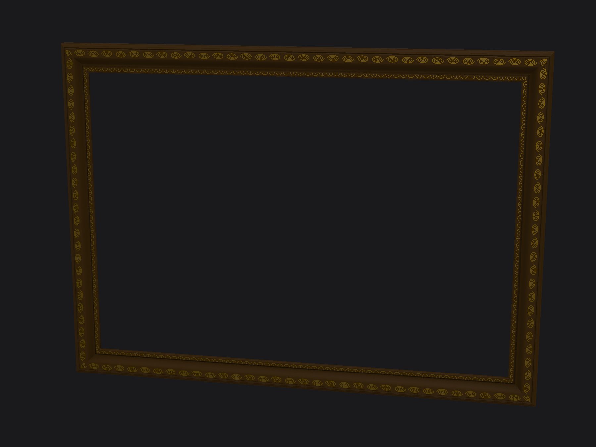
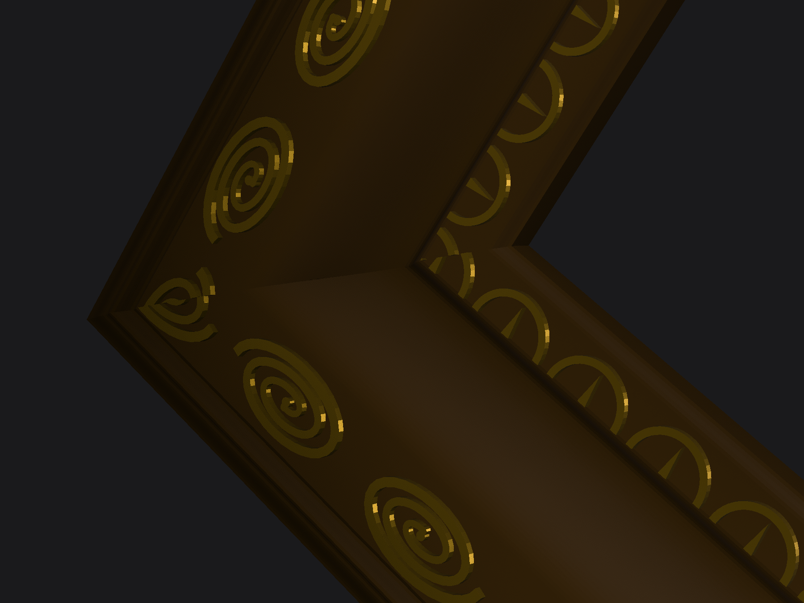
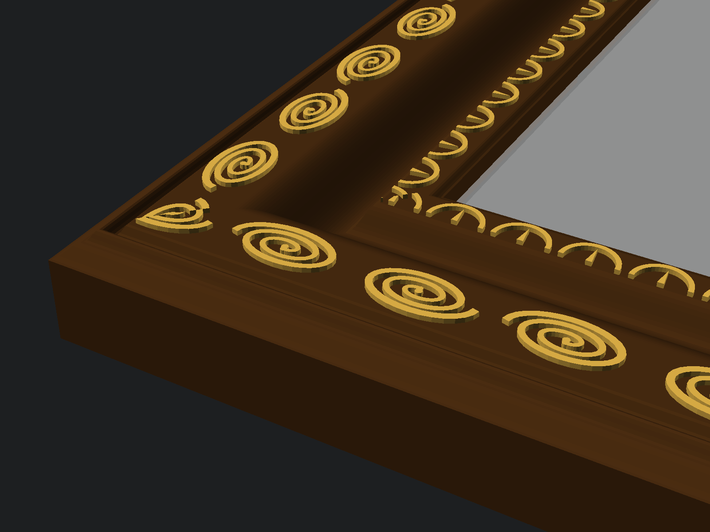
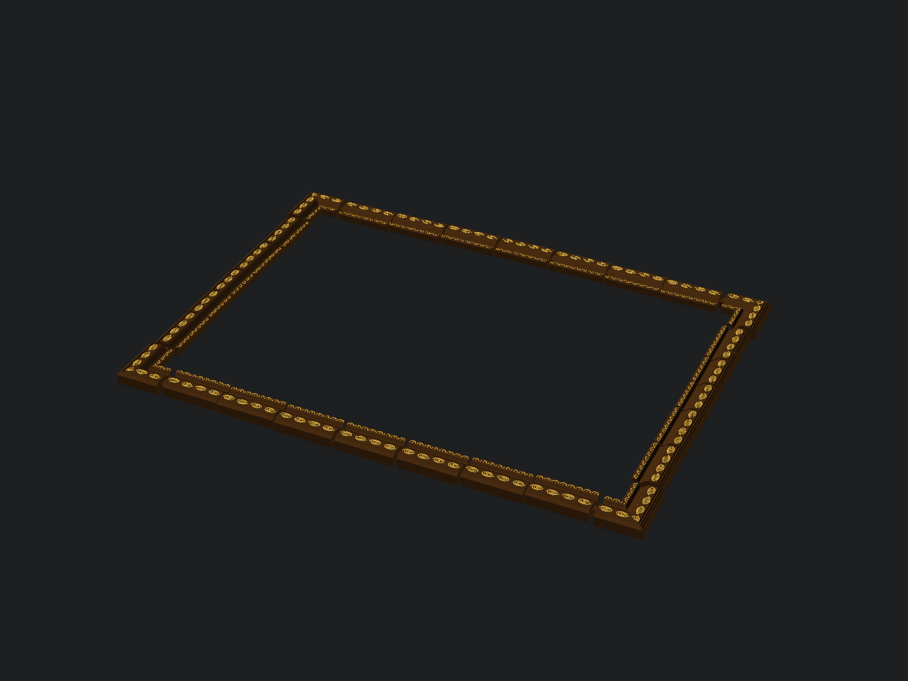

# Parametric Ornate Picture Frame

A fully parametric OpenSCAD picture frame for large frameless canvas paintings,
segmented so every piece fits a small printer bed (default: Bambu A1 Mini) and
joins with glueless press-fit dovetails. Default configuration targets a
130 × 90 × 2 cm canvas: **28 frame pieces + 14 retainer clips**, frame outer
size ≈ 1451 × 1051 mm, moulding ≈ 85 mm wide.

| | |
|---|---|
|  |  |
|  | View [`parametric-picture-frame.glb`](parametric-picture-frame.glb) interactively at [f3d.app/viewer](https://f3d.app/viewer) |

## Files

- `parametric-picture-frame.scad` — all parameters (OpenSCAD Customizer compatible) + render modes
- `lib/profiles.scad` — the 3 cross-section styles: `ogee`, `reverse_ogee`, `ripple`
- `lib/ornament.scad` — mathematically generated relief (running scroll + scallop bands)
- `lib/segmentation.scad` — bed-aware cut planning + dovetail joints
- `lib/clips.scad` — canvas retainer clips
- `export-all.sh` — exports every part STL into `stl/`

## Render modes (`render_mode`)

| mode | output |
|---|---|
| `assembled` | whole frame + ghost canvas (sanity view) |
| `exploded` | all parts pulled apart, tenons visible |
| `part` | one printable piece: `part_kind` (`straight`/`corner`) + `part_leg` + `part_index` |
| `fit_test` | small dovetail coupon pair — **print this first** |
| `clips` | plate with all retainer clips |
| `bom` | no geometry; echoes part list, sizes, screw count |

Corners are named by the leg at whose CCW start they sit: `bottom`→BL,
`right`→BR, `top`→TR, `left`→TL. Every part has its ID engraved in the back.

## Print settings (tested target)

- Bambu A1 Mini, Cool Super Tack plate, Matte Black PLA, 0.6 mm nozzle
- Orientation: decorative face UP (exports already lie this way) — no supports
- 2 walls, **lightning infill** — the frame is decorative, not structural
- The dovetail pocket roof is a small internal bridge; default bridge settings are fine

## Workflow

1. **Print `fit_test.stl`** (both coupons). Press together face-down like the
   real parts. Too tight → raise `dovetail_clearance` (steps of 0.04);
   too loose → lower it or raise `dovetail_taper`.
2. **Measure the coupon** (nominal 28 mm blocks). If it printed short, set the
   shrink factor, e.g. 0.3% short → `./export-all.sh 1.003`. The factor scales
   every part identically, so joints stay matched. On a 1300 mm span 0.3%
   is ~4 mm — this matters; `fit_clearance = 4` also budgets for it.
3. **Export everything**: `./export-all.sh [shrink]` → `stl/`.
4. **Print** 28 parts + `clips.stl` (14 clips, ~1 part per A1 Mini plate for
   the big segments).
5. **Assemble face-down on a flat surface**: corners first, then straights,
   dropping each tenon into its neighbor's pocket and pressing until seated.
   IDs run CCW: BL → B1…B7 → BR → R1…R5 → TR → T7…T1 → TL → L5…L1.
   Optional: a drop of CA glue in each pocket for permanence.
6. **Mount**: lay the frame face-down, drop the canvas into the pocket
   (it sits fully recessed), screw the 14 clips into the pilot-hole pockets
   (M3 × 8 self-tapping), noses over the stretcher bars. Rehang the painting
   on its existing two wall screws — the frame rides on the stretcher and the
   flat back sits flush against the wall.

## Key parameters

- `painting_width/height/thickness` — canvas size (default 1300 × 900 × 20 mm)
- `fit_clearance` — slack per side (default 4 mm; hidden by the lip)
- `lip_overlap` — how far the front lip overlaps the painting face (default 10 mm)
- `frame_scale` — moulding size, proportional to the painting diagonal
- `profile_style` — `ogee` (like the reference photo), `reverse_ogee`, `ripple`
- `ornament_*` — relief on/off, height, repeat period (seams always land in valleys)
- `printer` — `A1 Mini`, `A1`, `P1 X1`, `H2D` bed presets
- `dovetail_clearance/taper`, `shrinkage_compensation` — joint fit tuning
- `hanger_keyholes` — opt-in keyholes in the top corners for direct wall mounting

Multi-color gold-on-black like the reference: in Bambu Studio, use
*Color Painting → Height Range* to paint everything above the band surfaces
(top ~1.6 mm of the relief) gold.
