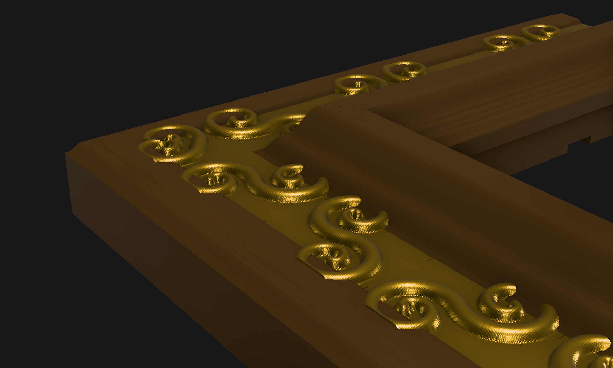

# Parametric Picture Frame

We have a 130 × 90 cm painting on stretched canvas and no frame for it. A real
frame in that size costs a fortune, so I'm printing one — on an A1 Mini with a
180 mm bed. This generator does the math for that: it splits the frame into 38
pieces with press-fit dovetails (no glue), plus 18 clips that hold the canvas
from behind.

Everything is one OpenSCAD project. Pick one of three *Querschnitt* (cross-section) styles, set
your canvas size, and the ornament is generated mathematically so that every
seam lands in a valley of the pattern. The finished frame comes out around
145 × 105 cm with an 85 mm moulding. The painting keeps hanging on its own two
wall screws — the frame just clips onto the stretcher and adds the drama.



| | |
|---|---|
|  |  |
|  | View [`parametric-picture-frame.glb`](parametric-picture-frame.glb) interactively at [f3d.app/viewer](https://f3d.app/viewer) |

## Files

- `parametric-picture-frame.scad` — all parameters (OpenSCAD Customizer compatible) + render modes
- `lib/profiles.scad` — the 3 cross-section styles: `ogee`, `reverse_ogee`, `ripple`
- `lib/ornament.scad` — mathematically generated relief (running scroll + scallop bands)
- `lib/segmentation.scad` — bed-aware cut planning + dovetail joints
- `lib/clips.scad` — canvas retainer clips
- `export-all.sh` — exports every part STL into `stl/`

## Bambu Studio export

The project 3mf is built by the local `openscad-3mf` skill (Claude Code), not
by a script in this repo:

```
./export-all.sh
read -r NH NV <<< "$(grep -o 'COUNTS [0-9]* [0-9]*' /tmp/frame_bom.echo | awk '{print $2, $3}')"
parts=(corner_BL B{1..$NH} corner_BR R{1..$NV} corner_TR T{$NH..1} corner_TL L{$NV..1} clips)
python3 ~/.claude/skills/openscad-3mf/scripts/build-3mf.py stl/${^parts}.stl \
  --out parametric-picture-frame.3mf --overrides bambu/overrides.json
```

Result: 39 objects on 23 A1 Mini plates in assembly order (plate previews
render on first slice), presets set (A1 mini 0.6 nozzle, PLA Matte, 0.42mm
Extra Draft) and the overrides from `bambu/overrides.json` — lightning infill,
10%, 2 walls, Arachne, auto supports — bundled as orange modified fields.
Nothing is sliced: open in Bambu Studio, check, slice, print plate by plate.

The 3mf is a Bambu Studio project file — plates and settings are Bambu-specific
metadata. Other slicers: use the STLs from `./export-all.sh` instead.

## Render modes (`render_mode`)

| mode | output |
|---|---|
| `assembled` | whole frame + ghost canvas (sanity view) |
| `exploded` | all parts pulled apart, tenons visible |
| `part` | one printable piece: `part_kind` (`straight`/`corner`) + `part_leg` + `part_index` |
| `fit_test` | small dovetail coupon pair — **print this first** |
| `clips` | plate with all retainer clips |
| `bom` | no geometry; echoes part list, sizes, screw count |

Corners are named by the leg at whose CCW start they sit: `bottom`→BL,
`right`→BR, `top`→TR, `left`→TL. Every part has its ID engraved in the back.

## Print settings (tested target)

- Bambu A1 Mini, Cool Super Tack plate, Matte Black PLA, 0.6 mm nozzle
- Orientation: decorative face UP (exports already lie this way)
- Supports ON (auto): the lip underside floats over the rabbet void — supports
  generate only there. The 3mf overrides enable this
- 2 walls, **lightning infill** — the frame is decorative, not structural
- The dovetail pocket roof is a small internal bridge; default bridge settings are fine

## Workflow

1. **Print `fit_test.stl`** (both coupons). Press together face-down like the
   real parts. Too tight → raise `dovetail_clearance` (steps of 0.04);
   too loose → lower it or raise `dovetail_taper`.
2. **Measure the coupon** (nominal 28 mm blocks). If it printed short, set the
   shrink factor, e.g. 0.3% short → `./export-all.sh 1.003`. The factor scales
   every part identically, so joints stay matched. On a 1300 mm span 0.3%
   is ~4 mm — this matters; `fit_clearance = 4` also budgets for it.
3. **Export everything**: `./export-all.sh [shrink]` → `stl/`.
4. **Print** 38 parts + `clips.stl` (18 clips, ~1 part per A1 Mini plate for
   the big segments).
5. **Assemble face-down on a flat surface**: corners first, then straights,
   dropping each tenon into its neighbor's pocket and pressing until seated.
   IDs run CCW: BL → B1…B7 → BR → R1…R5 → TR → T7…T1 → TL → L5…L1.
   Optional: a drop of CA glue in each pocket for permanence.
6. **Mount**: lay the frame face-down, drop the canvas into the pocket
   (it sits fully recessed), screw the 14 clips into the pilot-hole pockets
   (M3 × 8 self-tapping), noses over the stretcher bars. Rehang the painting
   on its existing two wall screws — the frame rides on the stretcher and the
   flat back sits flush against the wall.

## Key parameters

- `painting_width/height/thickness` — canvas size (default 1300 × 900 × 20 mm)
- `fit_clearance` — slack per side (default 4 mm; hidden by the lip)
- `lip_overlap` — how far the front lip overlaps the painting face (default 10 mm)
- `frame_scale` — moulding size, proportional to the painting diagonal
- `profile_style` — `ogee` (like the reference photo), `reverse_ogee`, `ripple`
- `ornament_*` — relief on/off, height, repeat period (seams always land in valleys)
- `printer` — `A1 Mini`, `A1`, `P1 X1`, `H2D` bed presets
- `dovetail_clearance/taper`, `shrinkage_compensation` — joint fit tuning
- `hanger_keyholes` — opt-in keyholes in the top corners for direct wall mounting

Multi-color gold-on-black like the reference: in Bambu Studio, use
*Color Painting → Height Range* to paint everything above the band surfaces
(top ~1.6 mm of the relief) gold.
